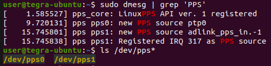
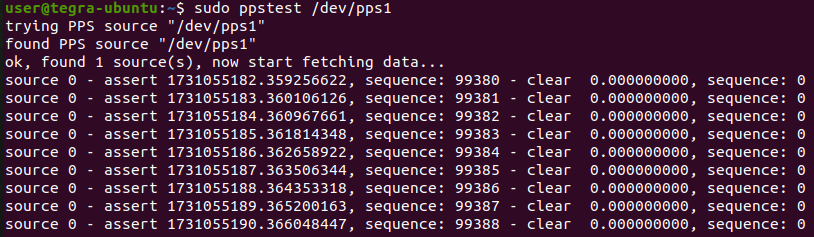

# pps-in-dts

The device tree overlay which maps the RQX-59G PPS_IN (DB50 Pin#21) to pps-gpio driver.

# SOP

Download device tree overlay source files:

```bash
git clone https://github.com/Adlink-ROS/pps-in-dts.git
```

Compile the device tree overlay. The Makefile will automatically merge the DTBO into the current using DTB:

```bash
cd pps-in-dts
make
```

Please restart the system to make new device tree take effect:

```bash
sync
sudo reboot
```

After bootup, please enter below commands to check if **pps1** can be found.




# Verification

Install pps-tools for PPS signal verification:

```bash
sudo apt install pps-tools
```

Enter below command to test pps:

```bash
sudo ppstest /dev/pps1
```

If PPS input exists, you should see the result simlar to below picture:



Now, the PPS input is ready to use.

**Note:** If a timeout occurs, please check the PPS wiring between DB50 Pin #21 of the RQX-59G and your PPS generator.

# Remove and Restore

If PPS_IN is no logger needed, you can enter below command to restore the original device tree:

```bash
cd pps-in-dts
make restore
```
